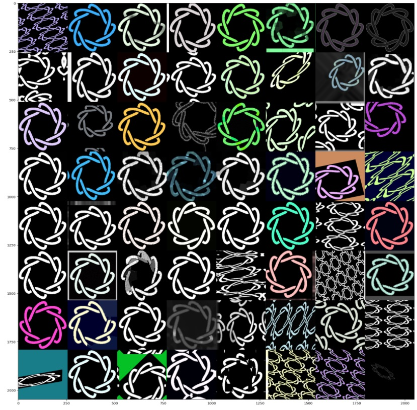
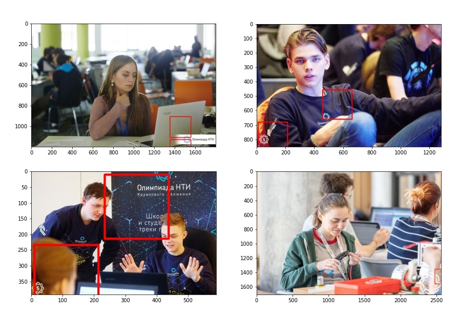

# Team: ***Branch predictors***  
## How to run  

1. pip3 install requirements.txt
2. python3 main.py data/img1.jpg

## Algorithm

1. We created synthetic dataset by applying augmentation transformations to target symbol and glueing it on images from ImageNet. See [synth_dataset.ipynb](synth_dataset.ipynb). Example of transformations:  

2. We fine-tuned Mobile-Net classifier to recognize symbol on images of size 244x244. See [transfer_learning.ipynb](transfer_learning.ipynb)  
3. Given source image, we divide it into segments of size 244x244 and run them through classifier. If classifier detects target symbol on any of the segments, algorithm classifies source image as containing symbol. See [mobilenet-cascade.ipynb](mobilenet-cascade.ipynb)  

Detection visualization:  

## Research

We tried several other methods in search of the best result:  
1. Pattern match, which was good but unable to detect rotated and resized symbols.
2. Haar cascade. This method is pretty accurate but during lack of time, we struggled to create a suitable dataset resulting in better results. Althoght we used a method to generate tons of negatives by slicing video into frames with ffmpeg. For instance, from 1 hour video we can create 60min\*60sec/min images. We can easily look through video to find out if there are symbols or not. One dataset is better on one "type" of symbols and the second one gives better results on other symbols. Nevertheless, haar cascade is or exact or has a high rate of false negatives.

> Script takes around 30s to run due to long loading times. The processing itself takes less then a second.
